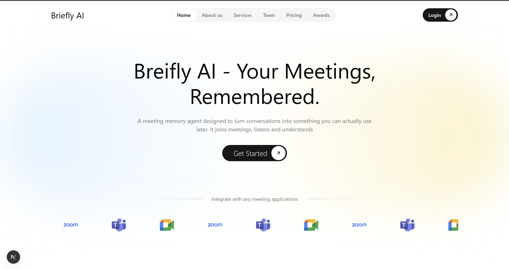
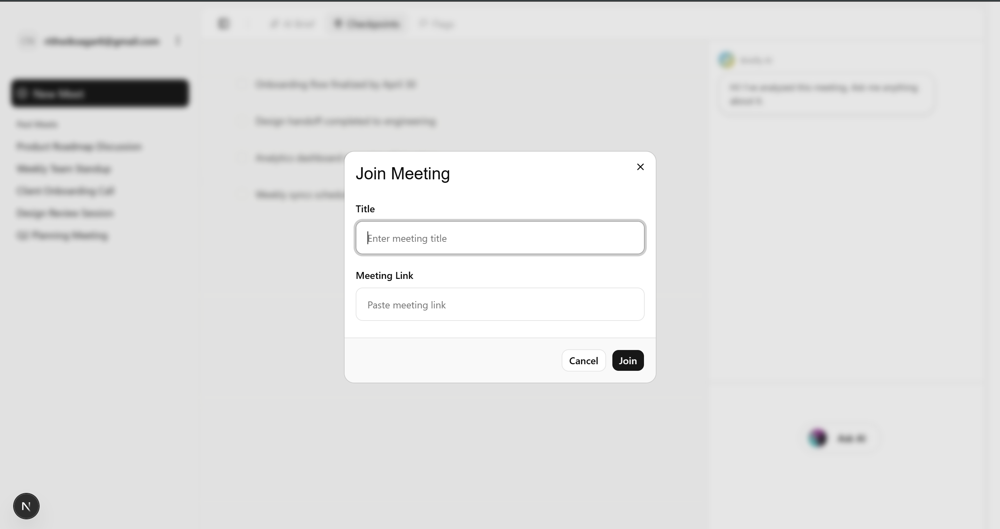
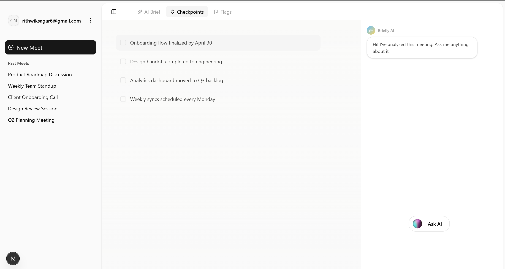

# Briefly AI — Your meetings, remembered.

Briefly AI is a meeting memory agent that captures conversations, extracts insights, and lets you query past meetings using natural language.

---

## Overview

- Joins meetings automatically  
- Transcribes conversations  
- Extracts key insights (promises, concerns, discussions)  
- Stores them as semantic memory  
- Lets you ask questions about past meetings  

---

## Screenshots

### Landing Page

---

### Join Meeting

---

### Dashboard

---

## How It Works

1. Bot joins meeting (Recall.ai)  
2. Transcript is generated  
3. LLM extracts insights  
4. Data stored in memory (Hindsight)  
5. User queries → system returns answers  

---

## Core Idea

Instead of storing full transcripts or just summaries, Briefly AI uses a **hybrid memory approach**:
- Structured insights  
- + Partial context  

This makes retrieval accurate and meaningful.

---

## Tech Stack

- Frontend: TypeScript  
- Backend: JavaScript  
- Recall.ai (meeting capture)  
- Hindsight (memory engine)  
- Gemini (LLM)  

---

## Our Contribution

- Built frontend using TypeScript  
- Designed query interaction flow  
- Integrated APIs with backend  
- Handled async states (loading, transcript delays)  
- Structured responses for better readability  

---

## Final Thought

Meetings shouldn’t be forgotten.

With Briefly AI, they become searchable, structured, and useful.
